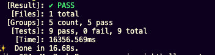
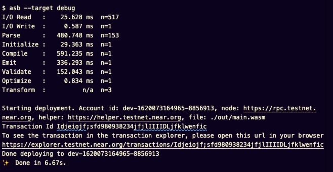
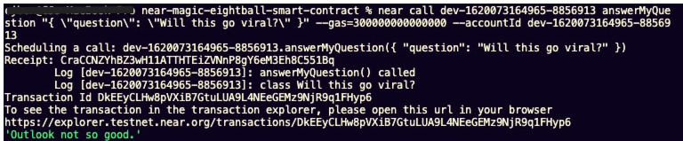

Magic Eight Ball Smart Contract
-------------------------------


Will I become a NEARionaire? 
Should I make pasta tonight?
Are my TikToks pretentious?

These are some of the pressing questions we face everyday. Luckily, we finally have Magic Eight Ball &trade; on the blockchain to help answer them!


Overview
--------

This Smart Contract takes a question, and returns an answer randomly, er, magically selected from a list of answers.
In addition, a user can:
* retrieve a list of all available answers
* add a unique answer to the list of answers
* retrieve a list of previous questions with the answers that were given.
* save their answered question to a list of previous questions.

Currently, this app runs exclusively from the terminal, but you can imagine how cool a front end for this could be. I asked the magic eight ball if I should make one, and it said, "ask again later". So, I guess we will just worry about getting the contract up and running for now.


Local Set Up
------------

After you've cloned this repo, Go ahead and run `yarn` in the terminal of the project's root directory.

You will need to configure your deployment environment if you haven't already. It's pretty simple. You need to make sure you have a NEAR account associated with your contract, and that this account has commit permission to wherever you plan to deploy the contract, e.g GitHub. If this is new to you, don't worry. Head over to this [Figment Tutorial](https://learn.figment.io/network-documentation/near/tutorials/intro-pathway-write-and-deploy-your-first-near-smart-contract/1.-connecting-to-a-near-node-using-datahub), to learn how to create an account, and configure your deployment environment. In fact, if you haven't already, please take an hour or so to complete it.That entire tutorial is amazing! 

After you've set up your `credentials/` directory with your _TestNet_ account for your contract your `.env` file should look something like this: 

```.env
NEAR_NODE_URL=https://near-testnet--rpc.datahub.figment.io/apikey/009090909090909090909090
NEAR_NETWORK=testnet
NEAR_ACCOUNT=my-magic-eightball-contract.testnet
DATAHUB_API_KEY=009090909090909090909090
```
These variables will be used when we deploy.


Test
----

When you're ready to test, run:

```
yarn test
```

You should see this in the terminal:



If you cloned this repo, installed everything, and ran the tests only to be met with odd compile errors, make sure that you do _NOT_ run `npm audit fix` when installing the project locally. Just ignore those warnings about there being "severe" vulnerabilities in the dependencies. I spent 3 hours debugging on a similar project before discovering why none of my tests were passing.


Deploy
-----

If you are satisfied with your tests, then we are ready to deploy in a dev environment. The NEAR CLI has a command, `near dev-deploy` that creates a dev NEAR account (testnet), creates a `neardev/` folder in your project to store it, and assigns our contract to it. 

In the terminal, run:

```
yarn dev
```

You should see something resembling this:




Calling Our Smart Contract
------

We can call our contract methods directly from the terminal. Examples of how to do this can be found in `executables/cli_commands`, but the structure is pretty simple:

```
$ near call dev-1620073164965-8856913 answerMyQuestion "{ \"question\": \"Will I be rich?\" }" --gas=300000000000000 --accountId dev-1620073164965-8856913

```
`dev-1620073164965-8856913` is the auto-generated account id NEAR CLI created and placed in `neardev/`. 

Then there is the method we are calling, `answerMyQuestion`, that is followed by a stringified object literal with the quotation marks escaped so the terminal will interpret it correctly. 

Then we have our gas allowance set to the max (optional).

Finally, we have our `accountId` which also points to `dev-1620073164965-8856913`

Your output should resemble this:




> When you're ready to switch over from a dev account to a permanent one, here's how:
> #### Step 1: Create an account for the contract
> Visit [NEAR Wallet] and make a new account. You'll be deploying these smart contracts to this new account.
> Now authorize NEAR CLI for this new account, and follow the instructions it gives you:
>    near login
> #### Step 2: set contract name in code
> Modify the line in `src/config.js` that sets the account name of the contract. Set it to the account id you used above.
>   const CONTRACT_NAME = process.env.CONTRACT_NAME || 'your-account-here!'
> #### Step 3: change remote URL if you cloned this repo 
> Unless you forked this repository you will need to change the remote URL to a repo that you have commit access to. This will allow auto deployment to Github Pages from the command line.
> 1) go to GitHub and create a new repository for this project
> 2) open your terminal and in the root of this project enter the following:
>    $ `git remote set-url origin https://github.com/YOUR_USERNAME/YOUR_REPOSITORY.git`
> #### Step 4: deploy!
> One command: `yarn deploy`.
>
> As you can see in `package.json`, this does two things:
> 1. builds & deploys smart contracts to NEAR TestNet
> 2. builds & deploys frontend code to GitHub using [gh-pages]. This will only work if the project already has a repository set up on GitHub. Feel free to modify the `deploy` script in `package.json` to deploy elsewhere.
> 
> _courtesy of [figment.io]_


That's it! Enjoy the magic of the NEAR smart contract Magic 8 Ball!


